# 🏗️ Demo Monorepo PNPM + Turborepo — Validator Bersama

Sebuah monorepo **minimal yang berfungsi penuh** yang mendemonstrasikan cara kerja paket bersama (shared packages) di seluruh **Next.js** dan **Express** menggunakan **PNPM Workspaces** dan **Turborepo**.

Proyek ini dibuat untuk **menghilangkan kebingungan** tentang:

- Di mana sebenarnya `node_modules` berada dalam monorepo
- Bagaimana cara kerja symlink
- Bagaimana Next.js dapat mengimpor paket bersama yang terletak di _luar_ folder root-nya
- Bagaimana Express dan Next.js dapat berbagi paket validator Zod yang **sama**
- Bagaimana alur penyiapan (setup) yang benar dari awal

---

## Daftar Isi

1. [Ikhtisar](#1-ikhtisar)
2. [Penyiapan Langkah-demi-Langkah](#2-penyiapan-langkah-demi-langkah)
3. [Struktur Folder](#3-struktur-folder)
4. [Penjelasan File Konfigurasi](#4-penjelasan-file-konfigurasi)
5. [Panduan Kode Sumber](#5-panduan-kode-sumber)
6. [Memahami node_modules & Symlink](#6-memahami-node_modules--symlink)
7. [Memahami Perilaku Deployment](#7-memahami-perilaku-deployment)

---

## 1. Ikhtisar

### Arsitektur

```mermaid
graph TD
    subgraph MONOREPO_ROOT["🏗️ MONOREPO ROOT"]
        WEB["📁 apps/web<br/><i>Next.js — Port 3000</i>"]
        API["📁 apps/api<br/><i>Express — Port 3001</i>"]
        VAL["📦 packages/validators<br/><i>Skema Zod</i>"]
        CONFIG["📄 pnpm-workspace.yaml + ⚡ turbo.json"]
    end

    WEB -->|mengimpor| VAL
    API -->|mengimpor| VAL

    style WEB fill:#3b82f6,stroke:#1e40af,color:#fff
    style API fill:#f97316,stroke:#c2410c,color:#fff
    style VAL fill:#8b5cf6,stroke:#6d28d9,color:#fff
    style CONFIG fill:#64748b,stroke:#475569,color:#fff
    style MONOREPO_ROOT fill:#0f172a,stroke:#334155,color:#e2e8f0

```



### Tech Stack

| Lapisan | Teknologi |
| --- | --- |
| Package Manager | PNPM (Workspaces) |
| Monorepo Tool | Turborepo |
| Web App | Next.js 15 (App Router) |
| API Server | Express (TypeScript) |
| Shared Validation | Zod |
| Build Tool | tsup (untuk validator) |
| Bahasa | TypeScript di mana-mana |

### Ide Inti

```mermaid
graph TD
    SCHEMA["📦 @repo/validators<br/><br/><code>userSchema = z.object &#123;<br/>  name: z.string&#40;&#41;,<br/>  email: z.string&#40;&#41;,<br/>  age: z.number&#40;&#41;<br/>&#125;</code>"]

    WEB["🌐 apps/web<br/><br/><code>import &#123; userSchema &#125;<br/>from @repo/validators</code><br/><br/>✅ Impor yang SAMA<br/>✅ Skema yang SAMA"]

    API["🔥 apps/api<br/><br/><code>import &#123; userSchema &#125;<br/>from @repo/validators</code><br/><br/>✅ Impor yang SAMA<br/>✅ Skema yang SAMA"]

    SCHEMA --> WEB
    SCHEMA --> API

    style SCHEMA fill:#8b5cf6,stroke:#6d28d9,color:#fff
    style WEB fill:#3b82f6,stroke:#1e40af,color:#fff
    style API fill:#f97316,stroke:#c2410c,color:#fff

```



> **✅ Nol duplikasi — ✅ Selalu sinkron**

---

## 2. Penyiapan Langkah-demi-Langkah

### Prasyarat

Pastikan Anda telah menginstal:

* **Node.js** v18+ → [nodejs.org](https://nodejs.org)
* **PNPM** v9+ → `npm install -g pnpm`

### Langkah 1: Buat Folder Root

```bash
mkdir devops-monorepo-structure
cd devops-monorepo-structure

```

**Mengapa?** Setiap monorepo dimulai dengan folder root yang akan menampung semua aplikasi dan paket bersama Anda.

### Langkah 2: Inisialisasi `package.json` Root

```bash
pnpm init

```

Kemudian edit `package.json` untuk menjadikannya `"private": true` dan tambahkan script Turborepo. Lihat [Bagian 4](https://www.google.com/search?q=%234-penjelasan-file-konfigurasi) untuk konten lengkapnya.

**Mengapa?**

* `"private": true` — mencegah publikasi paket root ke npm secara tidak sengaja.
* `package.json` root hanya berisi **scripts** dan **dev dependencies** yang digunakan bersama di seluruh repo (seperti `turbo` dan `typescript`).

### Langkah 3: Buat `pnpm-workspace.yaml`

Buat file ini di root:

```yaml
packages:
  - "apps/*"
  - "packages/*"

```

**Mengapa?** File ini memberi tahu PNPM: *"Hei, lihat ke dalam `apps/` dan `packages/` — setiap subfolder dengan `package.json` adalah workspace terpisah."*

Tanpa file ini, PNPM memperlakukan repo sebagai satu paket tunggal dan mengabaikan sub-paket sepenuhnya.

### Langkah 4: Buat `turbo.json`

```json
{
  "$schema": "[https://turbo.build/schema.json](https://turbo.build/schema.json)",
  "tasks": {
    "build": {
      "dependsOn": ["^build"],
      "outputs": ["dist/**", ".next/**"]
    },
    "dev": {
      "cache": false,
      "persistent": true
    },
    "lint": {
      "dependsOn": ["^build"]
    }
  }
}

```

**Mengapa?**

* `"dependsOn": ["^build"]` — tanda `^` berarti "bangun **dependensi** saya terlebih dahulu". Jadi jika `apps/web` bergantung pada `packages/validators`, Turborepo akan membangun `validators` **sebelum** membangun `web`.
* `"persistent": true` — server dev tidak berhenti (exit), jadi Turborepo harus membiarkannya tetap hidup.
* `"cache": false` — mode dev tidak boleh di-cache.

### Langkah 5: Buat Paket Bersama (`packages/validators`)

```bash
mkdir -p packages/validators/src

```

Kemudian buat file-file berikut:

* `packages/validators/package.json`
* `packages/validators/tsconfig.json`
* `packages/validators/tsup.config.ts`
* `packages/validators/src/user.schema.ts`
* `packages/validators/src/index.ts`

Lihat [Bagian 5](https://www.google.com/search?q=%235-panduan-kode-sumber) untuk konten lengkap.

**Mengapa?**

* Ini adalah **satu-satunya sumber kebenaran** untuk logika validasi Anda.
* Baik `apps/web` dan `apps/api` akan mengimpor dari `@repo/validators`.
* `tsup` memaketkannya (bundles) ke dalam format CommonJS dan ESM agar berfungsi di mana saja.

### Langkah 6: Buat API Express (`apps/api`)

```bash
mkdir -p apps/api/src

```

Kemudian buat file-file berikut:

* `apps/api/package.json`
* `apps/api/tsconfig.json`
* `apps/api/src/index.ts`

**Mengapa?** Server API menggunakan skema Zod bersama untuk memvalidasi permintaan yang masuk. Jika skema berubah di `packages/validators`, API secara otomatis mendapatkan pembaruan tersebut.

### Langkah 7: Buat Aplikasi Next.js (`apps/web`)

```bash
mkdir -p apps/web/src/app

```

Kemudian buat file-file berikut:

* `apps/web/package.json`
* `apps/web/next.config.js` ← **Kritis: harus menyertakan `transpilePackages`!**
* `apps/web/tsconfig.json`
* `apps/web/src/app/layout.tsx`
* `apps/web/src/app/page.tsx`
* `apps/web/src/app/globals.css`

**Mengapa?** Aplikasi web menggunakan skema Zod yang sama untuk validasi sisi klien. Kuncinya adalah `transpilePackages: ["@repo/validators"]` di `next.config.js` — ini memberi tahu Next.js untuk mengkompilasi kode dari luar foldernya sendiri.

### Langkah 8: Instal SEMUA Dependensi

```bash
# Dari root monorepo
pnpm install

```

**Mengapa?** PNPM membaca `pnpm-workspace.yaml`, menemukan semua paket workspace, dan:

1. Menginstal semua `node_modules` di **root** (hoisted/dinaikkan)
2. Membuat **symlink** di `node_modules` setiap workspace yang mengarah ke paket bersama
3. Menyelesaikan referensi `workspace:*` ke paket lokal alih-alih mengunduh dari npm

> **⚠️ PENTING:** Selalu jalankan `pnpm install` dari **root** monorepo, jangan pernah dari dalam sub-folder.

### Langkah 9: Bangun (Build) Semuanya

```bash
pnpm build

```

**Mengapa?** Turborepo akan:

1. Pertama membangun `packages/validators` (karena `apps/*` bergantung padanya via `^build`)
2. Kemudian membangun `apps/api` dan `apps/web` secara paralel

Urutan build ini **otomatis** — Turborepo membaca grafik dependensi.

### Langkah 10: Jalankan Server Dev

```bash
pnpm dev

```

Ini memulai **semua** server dev secara bersamaan:

* 🌐 Next.js → `http://localhost:3000`
* 🔥 Express → `http://localhost:3001`
* 👀 Validators → mengawasi perubahan (watching via `tsup --watch`)

---

## 3. Struktur Folder

Setelah menyelesaikan semua langkah, proyek Anda akan terlihat seperti ini:

```
devops-monorepo-structure/
├── 📄 .gitignore
├── 📄 .npmrc                          # Konfigurasi PNPM
├── 📄 package.json                    # Root — hanya scripts + devDeps
├── 📄 pnpm-workspace.yaml             # Mendefinisikan paket workspace
├── 📄 turbo.json                      # Pipeline tugas Turborepo
├── 📄 tsconfig.json                   # Konfigurasi dasar TypeScript
├── 📄 README.md
│
├── 📦 node_modules/                   # ← SEMUA deps dinaikkan (hoisted) ke sini
│   ├── @repo/
│   │   └── validators → ../../packages/validators  ← SYMLINK!
│   ├── react/
│   ├── next/
│   ├── express/
│   ├── zod/
│   └── ... (setiap dependensi)
│
├── 📁 apps/
│   ├── 📁 api/                        # Server API Express
│   │   ├── 📄 package.json
│   │   ├── 📄 tsconfig.json
│   │   └── 📁 src/
│   │       └── 📄 index.ts            # Endpoint POST /users
│   │
│   └── 📁 web/                        # Web App Next.js
│       ├── 📄 package.json
│       ├── 📄 next.config.js          # Konfigurasi transpilePackages
│       ├── 📄 tsconfig.json
│       └── 📁 src/
│           └── 📁 app/
│               ├── 📄 layout.tsx
│               ├── 📄 page.tsx        # Halaman demo validasi
│               └── 📄 globals.css
│
└── 📁 packages/
    └── 📁 validators/                 # Skema Zod Bersama
        ├── 📄 package.json
        ├── 📄 tsconfig.json
        ├── 📄 tsup.config.ts
        ├── 📁 dist/                   # ← Output Build (setelah pnpm build)
        │   ├── index.js               # CommonJS
        │   ├── index.mjs              # ESM
        │   └── index.d.ts             # Deklarasi Type
        └── 📁 src/
            ├── 📄 index.ts            # Ekspor Barrel
            └── 📄 user.schema.ts      # Definisi skema Zod

```

---

## 4. Penjelasan File Konfigurasi

### `pnpm-workspace.yaml` (Root)

```yaml
packages:
  - "apps/*" # Setiap folder di dalam apps/ adalah workspace
  - "packages/*" # Setiap folder di dalam packages/ adalah workspace

```

Ini adalah cara PNPM mengetahui di mana menemukan paket workspace. Tanpa ini, referensi `workspace:*` di file `package.json` tidak akan berfungsi.

---

### `package.json` (Root)

```json
{
  "name": "devops-monorepo-structure",
  "private": true,
  "scripts": {
    "build": "turbo run build",
    "dev": "turbo run dev",
    "lint": "turbo run lint"
  },
  "devDependencies": {
    "turbo": "^2.4.4",
    "typescript": "^5.7.3"
  },
  "packageManager": "pnpm@9.15.4"
}

```

| Kunci | Tujuan |
| --- | --- |
| `private: true` | Mencegah publikasi paket root ke npm |
| `scripts` | Mendelegasikan semuanya ke Turborepo |
| `devDependencies` | Hanya alat tingkat monorepo (turbo, typescript) |
| `packageManager` | Memastikan semua orang menggunakan versi PNPM yang sama |

---

### `turbo.json` (Root)

```json
{
  "tasks": {
    "build": {
      "dependsOn": ["^build"],
      "outputs": ["dist/**", ".next/**"]
    },
    "dev": {
      "cache": false,
      "persistent": true
    }
  }
}

```

| Kunci | Tujuan |
| --- | --- |
| `^build` | Bangun dependensi terlebih dahulu (validators → baru apps) |
| `outputs` | File yang dihasilkan oleh build (untuk caching) |
| `cache: false` | Jangan cache mode dev |
| `persistent: true` | Biarkan server dev tetap hidup (mereka tidak berhenti secara alami) |

---

### `next.config.js` (apps/web)

```js
const nextConfig = {
  transpilePackages: ["@repo/validators"],
};

```

> **🔑 Ini adalah konfigurasi paling penting di seluruh monorepo untuk Next.js.**
> Tanpa `transpilePackages`, Next.js akan menolak untuk mengkompilasi kode dari `packages/validators/` karena letaknya **di luar** direktori `apps/web/`.
> Opsi ini memberi tahu Next.js: *"Percayalah, paket ini perlu di-transpile oleh bundler saya, meskipun tidak ada di folder saya."*

---

### `.npmrc` (Root)

```
public-hoist-pattern[]=*

```

Ini memberi tahu PNPM untuk menaikkan (hoist) **semua** paket ke `node_modules/` root. Tanpa ini, beberapa paket (terutama React dan Next.js) mungkin gagal karena mereka mengharapkan dependensi mereka berada di lokasi bersama.

---

## 5. Panduan Kode Sumber

### Validator Bersama: `packages/validators/src/user.schema.ts`

```typescript
import { z } from "zod";

export const userSchema = z.object({
  name: z
    .string()
    .min(2, "Name must be at least 2 characters")
    .max(100, "Name must be at most 100 characters"),
  email: z.string().email("Invalid email address"),
  age: z
    .number()
    .int("Age must be a whole number")
    .positive("Age must be a positive number")
    .optional(),
});

export type User = z.infer<typeof userSchema>;

```

Ini adalah **satu-satunya sumber kebenaran**. Kedua aplikasi mengimpor dari sini. Jika Anda mengubah aturan validasi, kedua aplikasi diperbarui secara otomatis.

---

### API Express: `apps/api/src/index.ts`

```typescript
import { userSchema } from "@repo/validators"; // ← Impor bersama!

app.post("/users", (req, res) => {
  const result = userSchema.safeParse(req.body);

  if (!result.success) {
    res.status(400).json({
      success: false,
      errors: result.error.flatten().fieldErrors,
    });
    return;
  }

  res.status(200).json({
    success: true,
    data: result.data,
  });
});

```

**Tes itu:**

```bash
# Permintaan valid
curl -X POST http://localhost:3001/users \
  -H "Content-Type: application/json" \
  -d '{"name": "John Doe", "email": "john@example.com", "age": 25}'

# Permintaan tidak valid
curl -X POST http://localhost:3001/users \
  -H "Content-Type: application/json" \
  -d '{"name": "J", "email": "bad", "age": -1}'

```

---

### Halaman Next.js: `apps/web/src/app/page.tsx`

```typescript
import { userSchema } from "@repo/validators"; // ← Impor bersama yang SAMA!

function validate(data: unknown) {
  const result = userSchema.safeParse(data);
  // Tampilkan sukses atau error ke user...
}

```

Halaman memiliki dua tombol:

* ✅ "Validate Good Data" — memvalidasi `{ name: "John Doe", email: "john@example.com", age: 25 }`
* ❌ "Validate Bad Data" — memvalidasi `{ name: "J", email: "not-an-email", age: -5 }`

Keduanya menggunakan **`userSchema` yang persis sama** dengan API Express.

---

## 6. Memahami node_modules & Symlink

Di sinilah kebanyakan orang menjadi bingung. Mari kita perjelas.

### Di mana sebenarnya `node_modules` berada?

```
devops-monorepo-structure/
├── node_modules/          ← 🟢 YANG UTAMA (root)
│   ├── react/
│   ├── next/
│   ├── express/
│   ├── zod/
│   ├── typescript/
│   ├── @repo/
│   │   └── validators/   ← Ini adalah SYMLINK (lihat di bawah)
│   └── ... (semuanya)
│
├── apps/
│   ├── web/
│   │   └── node_modules/  ← 🟡 MUNGKIN ada atau MUNGKIN TIDAK
│   └── api/
│       └── node_modules/  ← 🟡 MUNGKIN ada atau MUNGKIN TIDAK
│
└── packages/
    └── validators/
        └── node_modules/  ← 🟡 MUNGKIN ada atau MUNGKIN TIDAK

```

### Aturannya

> **SEMUA dependensi diinstal di `node_modules/` ROOT.**
> Folder `node_modules/` di sub-workspace hanya muncul jika ada konflik versi (misalnya, `apps/web` membutuhkan `react@19` tetapi `apps/api` membutuhkan `react@18`).

### Apa itu Symlink?

**Symlink** (symbolic link) seperti **shortcut (jalan pintas)** di komputer Anda.

Saat Anda menjalankan `pnpm install`, PNPM membuat symlink ini:

```
node_modules/@repo/validators  →  packages/validators

```

Ini berarti:

* Saat `apps/web/src/app/page.tsx` melakukan `import { userSchema } from "@repo/validators"`
* Node.js mencari di `node_modules/@repo/validators/`
* Folder itu sebenarnya adalah **shortcut** yang menunjuk ke `packages/validators/`
* Jadi ia membaca file dari `packages/validators/dist/`


### Bagaimana Resolusi Modul Node Bekerja

Ketika file apa pun melakukan `import { userSchema } from "@repo/validators"`:

1. Node.js mulai mencari `@repo/validators` di `node_modules/`
2. Ia pertama-tama memeriksa `node_modules/` di **direktori saat ini**
3. Jika tidak ditemukan, ia berjalan **naik** ke pohon direktori
4. Akhirnya mencapai `node_modules/` di **root**
5. Menemukan `@repo/validators` (symlink tersebut)
6. Mengikuti symlink ke `packages/validators/`
7. Membaca `package.json` → `"main": "./dist/index.js"`
8. Mengimpor `packages/validators/dist/index.js`

Ini adalah resolusi modul standar Node.js — alat monorepo hanya memanfaatkannya melalui symlink.

### Mengapa `apps/web/node_modules` bisa muncul?

Ini bisa terjadi ketika:

* Sebuah paket membutuhkan **versi yang berbeda** dari apa yang di-hoist di root
* Mode isolasi ketat PNPM membuat direktori `.pnpm`
* Next.js menghasilkan cache-nya sendiri di dalam `node_modules/.cache`

**Ini adalah perilaku normal** — itu tidak berarti pengaturan Anda rusak.

---

## 7. Memahami Perilaku Deployment

### Apa yang Terjadi Selama `next build`

```mermaid
flowchart TD
    BUILD["⚡ pnpm build"] --> TURBO["1️⃣ Turborepo membaca turbo.json<br/><i>dependsOn: '^build'</i><br/>validators harus dibangun PERTAMA"]
    TURBO --> VAL["2️⃣ packages/validators — tsup<br/><b>Input:</b> src/index.ts + user.schema.ts<br/><b>Output:</b> dist/index.js, .mjs, .d.ts"]
    VAL --> API["3️⃣ apps/api — tsc<br/>Mengimpor @repo/validators dari dist/<br/><b>Output:</b> dist/ JS terkompilasi"]
    VAL --> WEB["4️⃣ apps/web — next build<br/>transpilePackages: @repo/validators<br/>Membundel kode validator KE DALAM .next/<br/><b>Output:</b> .next/ sepenuhnya mandiri"]

    style BUILD fill:#0f172a,stroke:#334155,color:#e2e8f0
    style TURBO fill:#64748b,stroke:#475569,color:#fff
    style VAL fill:#8b5cf6,stroke:#6d28d9,color:#fff
    style API fill:#f97316,stroke:#c2410c,color:#fff
    style WEB fill:#3b82f6,stroke:#1e40af,color:#fff

```



### Mengapa Mengimpor di Luar Root Web Berhasil

Orang sering khawatir: *"Paket validators ada di `packages/validators/`, yang berada di luar `apps/web/`. Bukankah ini akan rusak?"*

**Tidak, ini tidak akan rusak. Inilah alasannya:**

1. **Selama pengembangan:** `transpilePackages` memberi tahu Webpack/Turbopack Next.js untuk mengikuti symlink dan mengkompilasi kode, meskipun itu berada di luar `apps/web/`.
2. **Selama build:** Next.js membundel **semuanya** ke dalam folder `.next/`. Kode validator yang dikompilasi **disalin ke dalam** bundle tersebut. Output `.next/` akhir benar-benar mandiri (self-contained).
3. **Selama deployment:** Anda men-deploy folder `.next/`. Folder ini tidak peduli dari mana kode sumber berasal — semua yang dibutuhkannya sudah dibundel di dalamnya.


### Mengapa Ini TIDAK Merusak Deployment

| Kekhawatiran | Realitas |
| --- | --- |
| *"File berada di luar root web"* | Tidak masalah — `transpilePackages` menanganinya |
| *"Symlink tidak akan berfungsi di produksi"* | Symlink hanya diperlukan saat dev/build, bukan saat runtime |
| *"Struktur node_modules berbeda"* | Output build dibundel — `node_modules` tidak diperlukan saat runtime untuk Next.js |
| *"Vercel tidak akan mengerti ini"* | Vercel memiliki dukungan monorepo asli dan memahami workspace PNPM |

### Men-deploy ke Vercel

Vercel secara otomatis mendeteksi workspace PNPM. Di pengaturan proyek Anda:

* **Root Directory:** `apps/web`
* **Build Command:** `cd ../.. && pnpm build --filter=@repo/web`
* **Output Directory:** `.next`

Vercel akan menginstal semua dependensi, membangun validators terlebih dahulu (menghormati pipeline Turborepo), lalu membangun aplikasi Next.js.

---

## Referensi Cepat

```bash
# Instal semua dependensi (selalu dari root!)
pnpm install

# Bangun semuanya (validators → api + web)
pnpm build

# Mulai semua server dev secara bersamaan
pnpm dev

# Bangun hanya aplikasi web (dengan dependensinya)
pnpm build --filter=@repo/web

# Tambahkan dependensi ke workspace tertentu
pnpm add axios --filter=@repo/api

# Tambahkan dev dependency bersama ke root
pnpm add -D prettier -w

```

---

## Lisensi

MIT

```

```
