# 🏗️ PNPM + Turborepo Monorepo — Shared Validators Demo

A **minimal, fully working** monorepo that demonstrates how shared packages work across **Next.js** and **Express** using **PNPM Workspaces** and **Turborepo**.

This project exists to **remove confusion** about:

- Where `node_modules` actually lives in a monorepo
- How symlinks work
- How Next.js can import a shared package located _outside_ its root folder
- How Express and Next.js can share the **same** Zod validator package
- What the correct setup flow is from scratch

---

## Table of Contents

1. [Overview](#1-overview)
2. [Step-by-Step Setup](#2-step-by-step-setup)
3. [Folder Structure](#3-folder-structure)
4. [Config Files Explained](#4-config-files-explained)
5. [Source Code Walkthrough](#5-source-code-walkthrough)
6. [Understanding node_modules & Symlinks](#6-understanding-node_modules--symlinks)
7. [Understanding Deployment Behavior](#7-understanding-deployment-behavior)
8. [Docker Configuration & Running Locally](#8-docker-configuration--running-locally)
9. [CI/CD Pipeline (GitHub Actions)](#9-cicd-pipeline-github-actions)

---

## 1. Overview

### Architecture

```mermaid
graph TD
    subgraph MONOREPO_ROOT["🏗️ MONOREPO ROOT"]
        WEB["📁 apps/web<br/><i>Next.js — Port 3000</i>"]
        API["📁 apps/api<br/><i>Express — Port 3001</i>"]
        VAL["📦 packages/validators<br/><i>Zod Schemas</i>"]
        CONFIG["� pnpm-workspace.yaml + ⚡ turbo.json"]
    end

    WEB -->|imports| VAL
    API -->|imports| VAL

    style WEB fill:#3b82f6,stroke:#1e40af,color:#fff
    style API fill:#f97316,stroke:#c2410c,color:#fff
    style VAL fill:#8b5cf6,stroke:#6d28d9,color:#fff
    style CONFIG fill:#64748b,stroke:#475569,color:#fff
    style MONOREPO_ROOT fill:#0f172a,stroke:#334155,color:#e2e8f0
```



### Tech Stack

| Layer             | Technology              |
| ----------------- | ----------------------- |
| Package Manager   | PNPM (Workspaces)       |
| Monorepo Tool     | Turborepo               |
| Web App           | Next.js 15 (App Router) |
| API Server        | Express (TypeScript)    |
| Shared Validation | Zod                     |
| Build Tool        | tsup (for validators)   |
| Language          | TypeScript everywhere   |

### The Core Idea


> **✅ Zero duplication — ✅ Always in sync**

---

## 2. Step-by-Step Setup

### Prerequisites

Make sure you have installed:

- **Node.js** v18+ → [nodejs.org](https://nodejs.org)
- **PNPM** v9+ → `npm install -g pnpm`

### Step 1: Create the Root Folder

```bash
mkdir devops-monorepo-structure
cd devops-monorepo-structure
```

**Why?** Every monorepo starts with a root folder that will contain all your apps and shared packages.

### Step 2: Initialize the Root `package.json`

```bash
pnpm init
```

Then edit `package.json` to make it `"private": true` and add Turborepo scripts. See [Section 4](#4-config-files-explained) for the full content.

**Why?**

- `"private": true` — prevents accidentally publishing the root package to npm.
- The root `package.json` only contains **scripts** and **dev dependencies** shared across the repo (like `turbo` and `typescript`).

### Step 3: Create `pnpm-workspace.yaml`

Create the file at the root:

```yaml
packages:
  - "apps/*"
  - "packages/*"
```

**Why?** This file tells PNPM: _"Hey, look inside `apps/` and `packages/` — each subfolder with a `package.json` is a separate workspace."_

Without this file, PNPM treats the repo as a single package and ignores the sub-packages entirely.

### Step 4: Create `turbo.json`

```json
{
  "$schema": "https://turbo.build/schema.json",
  "tasks": {
    "build": {
      "dependsOn": ["^build"],
      "outputs": ["dist/**", ".next/**"]
    },
    "dev": {
      "cache": false,
      "persistent": true
    },
    "lint": {
      "dependsOn": ["^build"]
    }
  }
}
```

**Why?**

- `"dependsOn": ["^build"]` — the `^` means "build my **dependencies** first". So if `apps/web` depends on `packages/validators`, Turborepo will build `validators` **before** building `web`.
- `"persistent": true` — dev servers don't exit, so Turborepo must keep them alive.
- `"cache": false` — dev mode shouldn't be cached.

### Step 5: Create the Shared Package (`packages/validators`)

```bash
mkdir -p packages/validators/src
```

Then create:

- `packages/validators/package.json`
- `packages/validators/tsconfig.json`
- `packages/validators/tsup.config.ts`
- `packages/validators/src/user.schema.ts`
- `packages/validators/src/index.ts`

See [Section 5](#5-source-code-walkthrough) for full content.

**Why?**

- This is the **single source of truth** for your validation logic.
- Both `apps/web` and `apps/api` will import from `@repo/validators`.
- `tsup` bundles it into both CommonJS and ESM formats so it works everywhere.

### Step 6: Create the Express API (`apps/api`)

```bash
mkdir -p apps/api/src
```

Then create:

- `apps/api/package.json`
- `apps/api/tsconfig.json`
- `apps/api/src/index.ts`

**Why?** The API server uses the shared Zod schema to validate incoming requests. If the schema changes in `packages/validators`, the API automatically gets the update.

### Step 7: Create the Next.js App (`apps/web`)

```bash
mkdir -p apps/web/src/app
```

Then create:

- `apps/web/package.json`
- `apps/web/next.config.js` ← **Critical: must include `transpilePackages`!**
- `apps/web/tsconfig.json`
- `apps/web/src/app/layout.tsx`
- `apps/web/src/app/page.tsx`
- `apps/web/src/app/globals.css`

**Why?** The web app uses the same shared Zod schema for client-side validation. The key insight is `transpilePackages: ["@repo/validators"]` in `next.config.js` — this tells Next.js to compile code from outside its own folder.

### Step 8: Install ALL Dependencies

```bash
# From the root of the monorepo
pnpm install
```

**Why?** PNPM reads `pnpm-workspace.yaml`, finds all workspace packages, and:

1. Installs all `node_modules` at the **root** (hoisted)
2. Creates **symlinks** in each workspace's `node_modules` pointing to the shared packages
3. Resolves `workspace:*` references to local packages instead of downloading from npm

> **⚠️ IMPORTANT:** Always run `pnpm install` from the **root** of the monorepo, never from inside a sub-folder.

### Step 9: Build Everything

```bash
pnpm build
```

**Why?** Turborepo will:

1. First build `packages/validators` (because `apps/*` depend on it via `^build`)
2. Then build `apps/api` and `apps/web` in parallel

The build order is **automatic** — Turborepo reads the dependency graph.

### Step 10: Run Dev Servers

```bash
pnpm dev
```

This starts **all** dev servers simultaneously:

- 🌐 Next.js → `http://localhost:3000`
- 🔥 Express → `http://localhost:3001`
- 👀 Validators → watching for changes (via `tsup --watch`)

---

## 3. Folder Structure

After completing all steps, your project looks like this:

```
devops-monorepo-structure/
├── 📄 .gitignore
├── 📄 .npmrc                          # PNPM configuration
├── 📄 .dockerignore                   # Files excluded from Docker context
├── 📄 package.json                    # Root — scripts + devDeps only
├── 📄 pnpm-workspace.yaml            # Defines workspace packages
├── 📄 turbo.json                      # Turborepo task pipeline
├── 📄 tsconfig.json                   # Base TypeScript config
├── 📄 docker-compose.yml             # Orchestrates nginx + web + api
├── 📄 README.md
│
├── 📦 node_modules/                   # ← ALL deps hoisted here
│   ├── @repo/
│   │   └── validators → ../../packages/validators  ← SYMLINK!
│   ├── react/
│   ├── next/
│   ├── express/
│   ├── zod/
│   └── ... (every dependency)
│
├── 📁 .github/
│   └── 📁 workflows/
│       └── 📄 deploy.yml              # CI/CD: Lint → Build → Deploy
│
├── 📁 nginx/                          # Reverse proxy configuration
│   ├── 📄 Dockerfile                  # nginx:alpine with custom config
│   └── 📄 nginx.conf                  # Routes /api/* and /* traffic
│
├── 📁 scripts/
│   └── 📄 deploy.sh                   # Standalone VPS deploy script
│
├── 📁 apps/
│   ├── 📁 api/                        # Express API Server
│   │   ├── 📄 Dockerfile              # Multi-stage build (turbo prune)
│   │   ├── 📄 package.json
│   │   ├── 📄 tsconfig.json
│   │   └── 📁 src/
│   │       └── 📄 index.ts            # POST /users endpoint
│   │
│   └── 📁 web/                        # Next.js Web App
│       ├── 📄 Dockerfile              # Multi-stage build (turbo prune)
│       ├── 📄 package.json
│       ├── 📄 next.config.js          # transpilePackages + standalone
│       ├── 📄 tsconfig.json
│       └── 📁 src/
│           └── 📁 app/
│               ├── 📄 layout.tsx
│               ├── 📄 page.tsx        # Validation demo page
│               └── 📄 globals.css
│
└── 📁 packages/
    └── 📁 validators/                 # Shared Zod Schemas
        ├── 📄 package.json
        ├── 📄 tsconfig.json
        ├── 📄 tsup.config.ts
        ├── 📁 dist/                   # ← Build output (after pnpm build)
        │   ├── index.js               # CommonJS
        │   ├── index.mjs              # ESM
        │   └── index.d.ts             # Type declarations
        └── 📁 src/
            ├── 📄 index.ts            # Barrel export
            └── 📄 user.schema.ts      # Zod schema definition
```

---

## 4. Config Files Explained

### `pnpm-workspace.yaml` (Root)

```yaml
packages:
  - "apps/*" # Each folder inside apps/ is a workspace
  - "packages/*" # Each folder inside packages/ is a workspace
```

This is how PNPM knows where to find workspace packages. Without this, `workspace:*` references in `package.json` files won't work.

---

### `package.json` (Root)

```json
{
  "name": "devops-monorepo-structure",
  "private": true,
  "scripts": {
    "build": "turbo run build",
    "dev": "turbo run dev",
    "lint": "turbo run lint"
  },
  "devDependencies": {
    "turbo": "^2.4.4",
    "typescript": "^5.7.3"
  },
  "packageManager": "pnpm@9.15.4"
}
```

| Key               | Purpose                                      |
| ----------------- | -------------------------------------------- |
| `private: true`   | Prevents publishing root to npm              |
| `scripts`         | Delegates everything to Turborepo            |
| `devDependencies` | Only monorepo-wide tools (turbo, typescript) |
| `packageManager`  | Ensures everyone uses the same PNPM version  |

---

### `turbo.json` (Root)

```json
{
  "tasks": {
    "build": {
      "dependsOn": ["^build"],
      "outputs": ["dist/**", ".next/**"]
    },
    "dev": {
      "cache": false,
      "persistent": true
    }
  }
}
```

| Key                | Purpose                                            |
| ------------------ | -------------------------------------------------- |
| `^build`           | Build dependencies first (validators → then apps)  |
| `outputs`          | Files produced by builds (for caching)             |
| `cache: false`     | Don't cache dev mode                               |
| `persistent: true` | Keep dev servers alive (they don't naturally exit) |

---

### `next.config.js` (apps/web)

```js
const nextConfig = {
  transpilePackages: ["@repo/validators"],
};
```

> **🔑 This is the most important config in the entire monorepo for Next.js.**
>
> Without `transpilePackages`, Next.js would refuse to compile code from `packages/validators/` because it lives **outside** the `apps/web/` directory.
>
> This option tells Next.js: _"Trust me, this package needs to be transpiled by my bundler, even though it's not in my folder."_

---

### `.npmrc` (Root)

```
public-hoist-pattern[]=*
```

This tells PNPM to hoist **all** packages to the root `node_modules/`. Without this, some packages (especially React and Next.js) may fail because they expect their dependencies to be at a shared location.

---

## 5. Source Code Walkthrough

### Shared Validator: `packages/validators/src/user.schema.ts`

```typescript
import { z } from "zod";

export const userSchema = z.object({
  name: z
    .string()
    .min(2, "Name must be at least 2 characters")
    .max(100, "Name must be at most 100 characters"),
  email: z.string().email("Invalid email address"),
  age: z
    .number()
    .int("Age must be a whole number")
    .positive("Age must be a positive number")
    .optional(),
});

export type User = z.infer<typeof userSchema>;
```

This is the **single source of truth**. Both apps import from here. If you change a validation rule, both apps update automatically.

---

### Express API: `apps/api/src/index.ts`

```typescript
import { userSchema } from "@repo/validators"; // ← Shared import!

app.post("/users", (req, res) => {
  const result = userSchema.safeParse(req.body);

  if (!result.success) {
    res.status(400).json({
      success: false,
      errors: result.error.flatten().fieldErrors,
    });
    return;
  }

  res.status(200).json({
    success: true,
    data: result.data,
  });
});
```

**Test it:**

```bash
# Valid request
curl -X POST http://localhost:3001/users \
  -H "Content-Type: application/json" \
  -d '{"name": "John Doe", "email": "john@example.com", "age": 25}'

# Invalid request
curl -X POST http://localhost:3001/users \
  -H "Content-Type: application/json" \
  -d '{"name": "J", "email": "bad", "age": -1}'
```

---

### Next.js Page: `apps/web/src/app/page.tsx`

```typescript
import { userSchema } from "@repo/validators"; // ← SAME shared import!

function validate(data: unknown) {
  const result = userSchema.safeParse(data);
  // Show success or error to user...
}
```

The page has two buttons:

- ✅ "Validate Good Data" — validates `{ name: "John Doe", email: "john@example.com", age: 25 }`
- ❌ "Validate Bad Data" — validates `{ name: "J", email: "not-an-email", age: -5 }`

Both use the **exact same `userSchema`** as the Express API.

---

## 6. Understanding node_modules & Symlinks

This is where most people get confused. Let's clear it up.

### Where does `node_modules` actually live?

```
devops-monorepo-structure/
├── node_modules/          ← 🟢 THE MAIN ONE (root)
│   ├── react/
│   ├── next/
│   ├── express/
│   ├── zod/
│   ├── typescript/
│   ├── @repo/
│   │   └── validators/   ← This is a SYMLINK (see below)
│   └── ... (everything)
│
├── apps/
│   ├── web/
│   │   └── node_modules/  ← 🟡 MAY or MAY NOT exist
│   └── api/
│       └── node_modules/  ← 🟡 MAY or MAY NOT exist
│
└── packages/
    └── validators/
        └── node_modules/  ← 🟡 MAY or MAY NOT exist
```

### The Rule

> **ALL dependencies are installed in the ROOT `node_modules/`.**
>
> Sub-workspace `node_modules/` folders only appear when there are version conflicts (e.g., `apps/web` needs `react@19` but `apps/api` needs `react@18`).

### What is a Symlink?

A **symlink** (symbolic link) is like a **shortcut** on your computer.

When you run `pnpm install`, PNPM creates this symlink:

```
node_modules/@repo/validators  →  packages/validators
```

This means:

- When `apps/web/src/app/page.tsx` does `import { userSchema } from "@repo/validators"`
- Node.js looks in `node_modules/@repo/validators/`
- That folder is actually a **shortcut** pointing to `packages/validators/`
- So it reads the files from `packages/validators/dist/`


### How Node Module Resolution Works

When any file does `import { userSchema } from "@repo/validators"`:

1. Node.js starts looking for `@repo/validators` in `node_modules/`
2. It first checks the **current directory's** `node_modules/`
3. If not found, it walks **up** the directory tree
4. Eventually reaches the **root** `node_modules/`
5. Finds `@repo/validators` (the symlink)
6. Follows the symlink to `packages/validators/`
7. Reads `package.json` → `"main": "./dist/index.js"`
8. Imports `packages/validators/dist/index.js`

This is standard Node.js module resolution — the monorepo tooling just leverages it via symlinks.

### Why might `apps/web/node_modules` appear?

This can happen when:

- A package needs a **different version** than what's hoisted at root
- PNPM's strict isolation mode creates `.pnpm` directories
- Next.js generates its own cache inside `node_modules/.cache`

**This is normal behavior** — it doesn't mean your setup is broken.

---

## 7. Understanding Deployment Behavior

### What Happens During `next build`

```mermaid
flowchart TD
    BUILD["⚡ pnpm build"] --> TURBO["1️⃣ Turborepo reads turbo.json<br/><i>dependsOn: '^build'</i><br/>validators must build FIRST"]
    TURBO --> VAL["2️⃣ packages/validators — tsup<br/><b>Input:</b> src/index.ts + user.schema.ts<br/><b>Output:</b> dist/index.js, .mjs, .d.ts"]
    VAL --> API["3️⃣ apps/api — tsc<br/>Imports @repo/validators from dist/<br/><b>Output:</b> dist/ compiled JS"]
    VAL --> WEB["4️⃣ apps/web — next build<br/>transpilePackages: @repo/validators<br/>Bundles validator code INTO .next/<br/><b>Output:</b> .next/ fully self-contained"]

    style BUILD fill:#0f172a,stroke:#334155,color:#e2e8f0
    style TURBO fill:#64748b,stroke:#475569,color:#fff
    style VAL fill:#8b5cf6,stroke:#6d28d9,color:#fff
    style API fill:#f97316,stroke:#c2410c,color:#fff
    style WEB fill:#3b82f6,stroke:#1e40af,color:#fff
```



### Why Importing Outside Web Root Works

People often worry: _"The validators package is in `packages/validators/`, which is outside `apps/web/`. Won't this break?"_

**No, it won't break. Here's why:**

1. **During development:** `transpilePackages` tells Next.js's Webpack/Turbopack to follow the symlink and compile the code, even though it's outside `apps/web/`.

2. **During build:** Next.js bundles **everything** into the `.next/` folder. The compiled validator code is **copied into** the bundle. The final `.next/` output is completely self-contained.

3. **During deployment:** You deploy the `.next/` folder. It doesn't care where the source code came from — everything it needs is already bundled inside.


### Why This Does NOT Break Deployment

| Concern                               | Reality                                                                   |
| ------------------------------------- | ------------------------------------------------------------------------- |
| _"Files are outside web root"_        | Doesn't matter — `transpilePackages` handles it                           |
| _"Symlinks won't work in production"_ | Symlinks are only needed during dev/build, not at runtime                 |
| _"node_modules structure differs"_    | Build output is bundled — no `node_modules` needed at runtime for Next.js |
| _"Vercel won't understand this"_      | Vercel has native monorepo support and understands PNPM workspaces        |

### Deploying to Vercel

Vercel automatically detects PNPM workspaces. In your project settings:

- **Root Directory:** `apps/web`
- **Build Command:** `cd ../.. && pnpm build --filter=@repo/web`
- **Output Directory:** `.next`

Vercel will install all dependencies, build validators first (respecting Turborepo's pipeline), then build the Next.js app.

---

## 8. Docker Configuration & Running Locally

The monorepo is fully containerized with **Docker Compose**. A single command brings up the entire stack: an **Nginx reverse proxy**, the **Next.js frontend**, and the **Express API** — all on an isolated internal network.

### Starting the Stack

```bash
# Build and start everything (first run)
docker compose up --build

# Or run in detached mode (background)
docker compose up --build -d
```

That's it. Visit:

- 🌐 **Frontend:** `http://localhost/`
- 🔥 **API:** `http://localhost/api/`

> **🔑 Key insight:** You never access apps by their individual ports (3000, 3001) in production. All traffic goes through Nginx on port 80, which routes it internally.

### Network Architecture


| Property                     | Nginx            | Next.js (web)     | Express (api)     |
| ---------------------------- | ---------------- | ----------------- | ----------------- |
| **Exposed to host?**         | ✅ Yes (port 80) | ❌ No             | ❌ No             |
| **Accessible from browser?** | ✅ Directly      | 🔒 Only via Nginx | 🔒 Only via Nginx |
| **Internal port**            | 80               | 3000              | 3001              |
| **Health check**             | `/nginx-health`  | `wget :3000/`     | `wget :3001/`     |

### How the Multi-Stage Docker Build Works

Building a monorepo app is tricky — you can't just `COPY . .` because that includes `apps/api` source code inside the `apps/web` image. The solution: **`turbo prune`**.

```mermaid
flowchart TD
    subgraph FULL["📂 Full Monorepo (~500MB)"]
        F_WEB["apps/web/"]
        F_API["apps/api/"]
        F_VAL["packages/validators/"]
        F_LOCK["pnpm-lock.yaml"]
        F_NODE["node_modules/"]
    end

    PRUNE["⚡ turbo prune @repo/web --docker"]

    subgraph PRUNED["✂️ Pruned Output (minimal)"]
        P_JSON["out/json/<br/><i>package.json files +<br/>pruned lockfile only</i>"]
        P_FULL["out/full/<br/><i>Only apps/web/ +<br/>packages/validators/<br/>source code</i>"]
    end

    FULL --> PRUNE --> PRUNED

    style FULL fill:#1e293b,stroke:#334155,color:#e2e8f0
    style PRUNED fill:#14532d,stroke:#166534,color:#e2e8f0
    style PRUNE fill:#8b5cf6,stroke:#6d28d9,color:#fff
    style F_WEB fill:#3b82f6,stroke:#1e40af,color:#fff
    style F_API fill:#ef4444,stroke:#b91c1c,color:#fff
    style F_VAL fill:#8b5cf6,stroke:#6d28d9,color:#fff
    style F_LOCK fill:#64748b,stroke:#475569,color:#fff
    style F_NODE fill:#64748b,stroke:#475569,color:#fff
    style P_JSON fill:#22c55e,stroke:#15803d,color:#fff
    style P_FULL fill:#22c55e,stroke:#15803d,color:#fff
```



> **Notice:** `apps/api/` is **excluded** from the pruned output when building the `web` image. Each app only gets what it needs.

Each Dockerfile has **4 stages**:

| Stage            | What it does                                                        | Why                                                                    |
| ---------------- | ------------------------------------------------------------------- | ---------------------------------------------------------------------- |
| **1. Pruner**    | Runs `turbo prune @repo/web --docker`                               | Extracts only the target app + its shared dependencies                 |
| **2. Installer** | Copies pruned `package.json` files + lockfile, runs `pnpm install`  | Dependency layer is Docker-cached — only re-runs when lockfile changes |
| **3. Builder**   | Copies pruned source code, runs `pnpm turbo run build`              | Compiles TypeScript and bundles the application                        |
| **4. Runner**    | Copies only the compiled output into a clean `node:22-alpine` image | Final image is minimal (~50MB) and runs as a non-root user             |

**Why this matters:**

- Changing code in `apps/api` does **NOT** invalidate the Docker cache for `apps/web`
- The final images don't contain source code, dev dependencies, or other apps
- Each image runs as a non-root user (`nextjs` / `expressjs`) for security

### What Nginx Does

The `nginx/nginx.conf` reverse proxy handles:

| Feature                  | Details                                                                            |
| ------------------------ | ---------------------------------------------------------------------------------- |
| **Routing**              | `/api/*` → Express (strips the `/api` prefix), `/*` → Next.js                      |
| **Gzip compression**     | Compresses text, JSON, CSS, JS, SVG responses                                      |
| **Static asset caching** | `/_next/static/*` cached for 1 year (content-hashed filenames)                     |
| **HTML caching**         | `no-cache` — always serves fresh pages                                             |
| **Security headers**     | `X-Frame-Options`, `X-Content-Type-Options`, `X-XSS-Protection`, `Referrer-Policy` |
| **Rate limiting**        | 10 requests/second per IP on `/api/*` endpoints (burst up to 20)                   |

---

## 9. CI/CD Pipeline (GitHub Actions)

The project includes a fully automated pipeline that runs on every push to `main` and every pull request.

### What Happens When

```mermaid
flowchart TD
    subgraph TRIGGER["🔔 Trigger"]
        PR["Pull Request to main"]
        PUSH["Push to main"]
    end

    LINT["🔍 Job 1: Lint & Type Check<br/><br/><code>pnpm turbo run lint</code><br/><code>pnpm turbo run typecheck</code><br/><br/>Runs across ALL workspaces"]

    BUILD["🐳 Job 2: Build & Push<br/><br/>Build Docker images<br/>Tag with short SHA + latest<br/>Push to Docker Hub"]

    DEPLOY["🚀 Job 3: Deploy<br/><br/>SCP docker-compose.yml to VPS<br/>SSH → docker compose up -d<br/>Verify health checks"]

    PR --> LINT
    PUSH --> LINT --> BUILD --> DEPLOY

    style PR fill:#8b5cf6,stroke:#6d28d9,color:#fff
    style PUSH fill:#22c55e,stroke:#15803d,color:#fff
    style LINT fill:#3b82f6,stroke:#1e40af,color:#fff
    style BUILD fill:#f97316,stroke:#c2410c,color:#fff
    style DEPLOY fill:#ef4444,stroke:#b91c1c,color:#fff
    style TRIGGER fill:#1e293b,stroke:#334155,color:#e2e8f0
```



| Event            | Job 1: Lint & Typecheck | Job 2: Build & Push          | Job 3: Deploy                |
| ---------------- | ----------------------- | ---------------------------- | ---------------------------- |
| **Pull Request** | ✅ Runs                 | ❌ Skipped                   | ❌ Skipped                   |
| **Push to main** | ✅ Runs                 | ✅ Runs (after Job 1 passes) | ✅ Runs (after Job 2 passes) |

**Why?** Pull requests only need code quality checks. Building and deploying should only happen when code is actually merged into `main`.

### Image Tagging Strategy

Every build produces Docker images tagged with:

- **Short SHA** (e.g., `abc1234`) — traceable to the exact commit
- **`latest`** — always points to the most recent build

```
yourusername/monorepo-web:abc1234
yourusername/monorepo-web:latest
yourusername/monorepo-api:abc1234
yourusername/monorepo-api:latest
```

### Required GitHub Secrets

Configure these in your GitHub repository settings under **Settings → Secrets and variables → Actions**:

| Secret               | Description                  | Example                        |
| -------------------- | ---------------------------- | ------------------------------ |
| `DOCKERHUB_USERNAME` | Docker Hub username          | `yourusername`                 |
| `DOCKERHUB_TOKEN`    | Docker Hub access token      | _(generate at hub.docker.com)_ |
| `VPS_HOST`           | VPS IP address or hostname   | `203.0.113.10`                 |
| `VPS_USERNAME`       | SSH user on the VPS          | `deploy`                       |
| `VPS_SSH_KEY`        | Full private SSH key content | _(paste entire key)_           |
| `VPS_PORT`           | SSH port                     | `22`                           |

### Deployment Flow

Once images are pushed to Docker Hub, the pipeline:

1. **Copies** `docker-compose.yml` to the VPS via SCP
2. **SSHs** into the server and pulls the new images
3. Runs **`docker compose up -d`** — Docker replaces the old containers with the new ones
4. **Verifies** health checks pass
5. **Prunes** old dangling images to save disk space

> **💡 Tip:** The `scripts/deploy.sh` script can also be run manually on any server for the same effect:
>
> ```bash
> ./scripts/deploy.sh yourusername abc1234
> ```

---

## Quick Reference

### Development Commands

```bash
# Install all dependencies (always from root!)
pnpm install

# Build everything (validators → api + web)
pnpm build

# Start all dev servers simultaneously
pnpm dev

# Build only the web app (with its dependencies)
pnpm build --filter=@repo/web

# Add a dependency to a specific workspace
pnpm add axios --filter=@repo/api

# Add a shared dev dependency to root
pnpm add -D prettier -w
```

### Docker Commands

```bash
# Build and start the full stack (nginx + web + api)
docker compose up --build

# Start in detached mode (background)
docker compose up --build -d

# Stop all containers
docker compose down

# View logs for all services
docker compose logs -f

# View logs for a specific service
docker compose logs -f api

# Rebuild without Docker cache (nuclear option)
docker compose build --no-cache

# Check container health status
docker compose ps

# Restart a single service
docker compose restart web
```

---

## License

MIT
